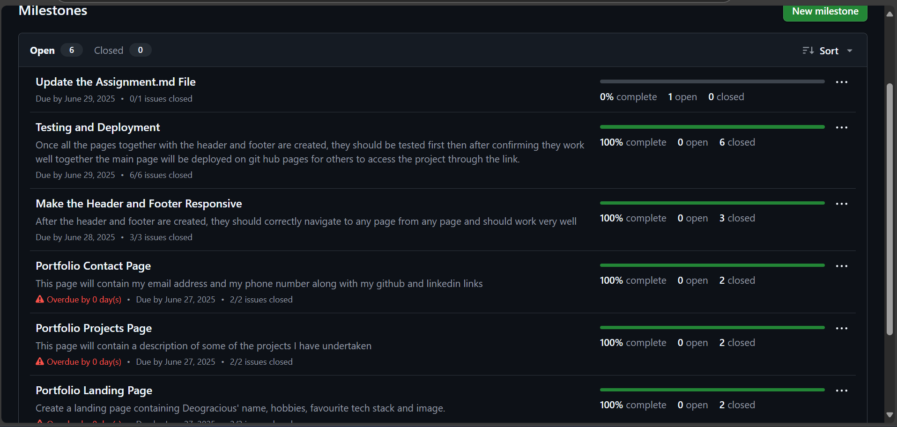
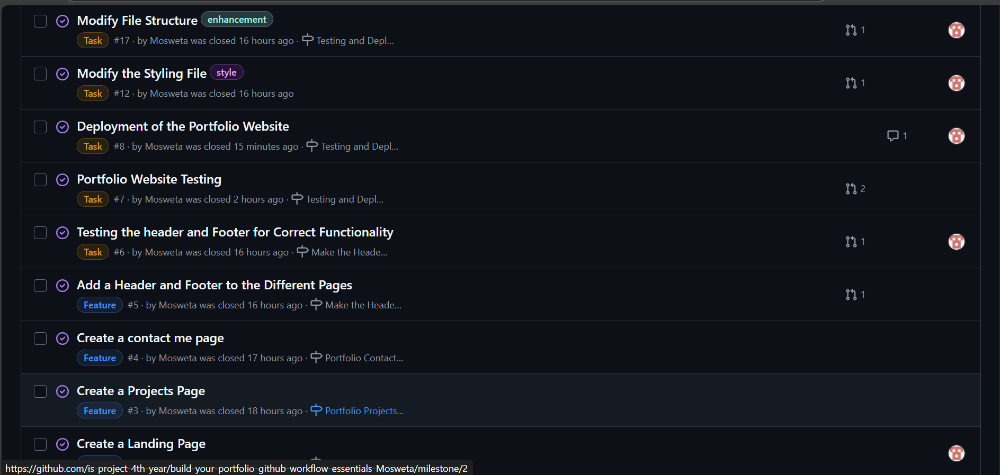
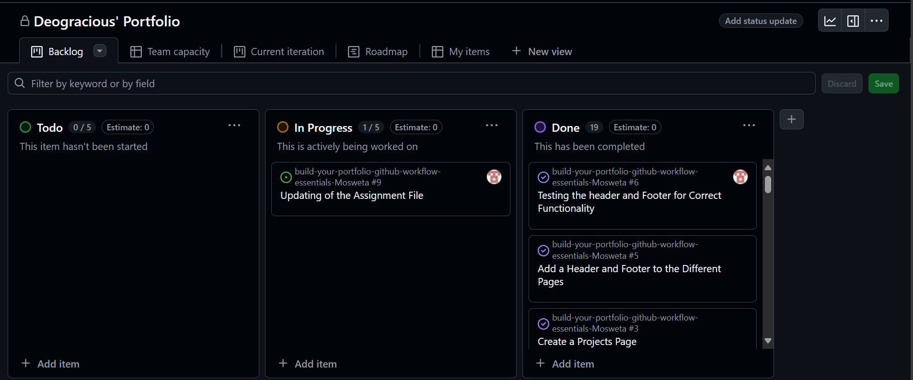
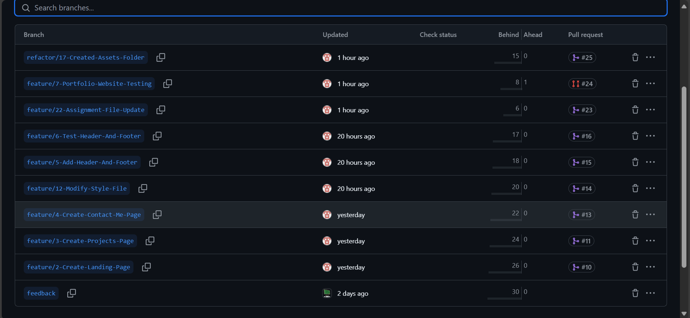
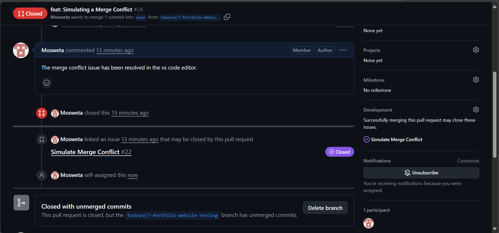
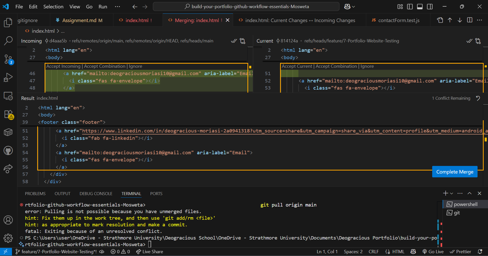

# Personal Portfolio Documentation

## 1. Student Details

- **Full Name**: Moriasi Deogracious Mosweta
- **Admission Number**: 150196
- **GitHub Username**: Mosweta
- **Email**: Deogracious.Moriasi@strathmore.edu

## 2. Deployed Portfolio Link

- **GitHub Pages URL**:  
(https://is-project-4th-year.github.io/build-your-portfolio-github-workflow-essentials-Mosweta/index.html)

## 3. Learnings from the Git Crash Program

Write about **4 things** you expected to learn during the Git crash course (yes, we all came in with some big hopes 😅).

**🧠 What I Thought I'd Learn vs What I Actually Learned**
**1. Concept: Branching**

`Expectation 👀` : I thought branching was just for different developers to do their modifications then push to the main.

`Reality 😅`: Turns out you can have as many branches as possible depending on the issue you are working on and it can be quite easy to track changes as long as the commits were done well.

`Impact 💡`: I created different branches for my portfolio to handle the different pages their updates, published them to the original repository and I must say it was very easy and I enjoyed. It was wonderful

**2. Concept: Merging**

`Expectation 👀` : I was expecting to learn how to resolve merge conflict.

`Reality 😅`: I learnt how a merge conflict arises, how to compare them using vs code editor and how to resolve them. I also learnt how to avoid getting them.

`Impact 💡`: I learnt merging best practices like pulling from main to get any changes posted there and then adding your changes. I learnt how to simulate a merge conflict and resolve it. I must say I am definitely wiser and more knowledgeable.

**3. Concept: Committing from vscode**

`Expectation 👀` : I expected to learn how to commit from vscode.

`Reality 😅`: I learnt how to stage changes, write proper commits using appropriate commit conventions, create pull request and then review by a peer in a project collaboration then the asigned person merges to the main branch

`Impact 💡`: This has made me to be more knowledgeable and confident in collaborating with others in a team project.

**4. Concept: Pulling and Pushing**

`Expectation 👀` : I wanted to learn how to pull and push.

`Reality 😅`: I learnt how to pull from remote repository main, stage your change, commit properly, push change to the remote branch, create a pull request, assign someone to review and merge it for you upon them ensuring everything is up to standard otherwise they can decline, then merge it. As a bonus I also learnt how to secure the main branch and deploy a static main.

`Impact 💡`: This made me to know correct procedures to follow in both an individual and collaborative project.

## 4. Screenshots of Key GitHub Features

Include screenshots that demonstrate how you used GitHub to manage your project. For each screenshot, write a short caption explaining what it shows.

> Upload the screenshots to your GitHub repository and reference them here using Markdown image syntax:
> (you could just simply copy and paste the image into the Assignment.md)

```markdown

```

### A. Milestones and Issues

- Screenshot showing your milestone(s) and the issues linked to it.

  This screenshot shows how I created a milestone and linked multiple issues to track progress in building the contact form and nav menu.



This screenshot shows the different issues I created.



### B. Project Board

- Screenshot of your GitHub Project Board with issues organized into columns (e.g., To Do, In Progress, Done).



### C. Branching

- Screenshot showing your branch list with meaningful naming.



### D. Pull Requests

- Screenshot of a pull request that’s either open or merged and linked to a related issue.



### E. Merge Conflict Resolution

- Screenshot of a resolved merge conflict (in a pull request, commit history, or your local terminal/GitHub Desktop).


